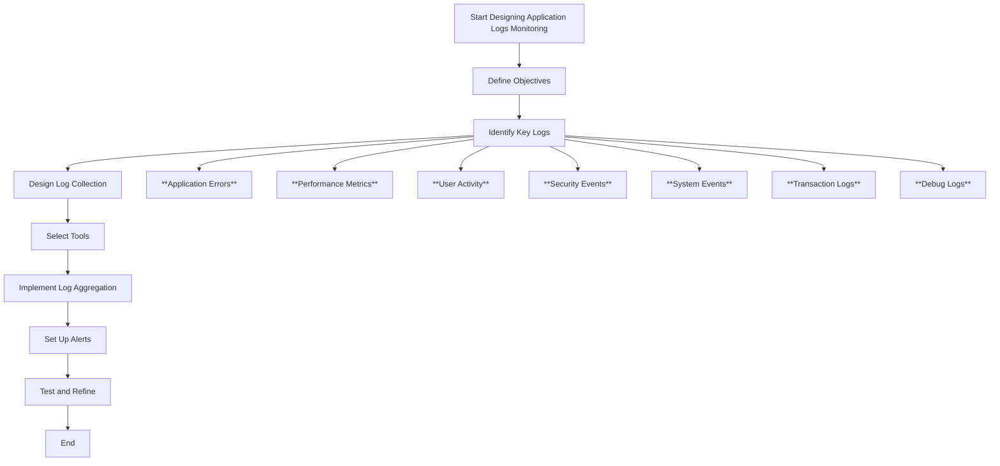

# Dashboard Designing of Application Logs Monitoring 

## Author

| Created/Updated | Version  | Author        | Comment                |           
|:---------------:|:--------:|:-------------:|:----------------------:|
| 02-08-2024      | 1.0      | Rahul Sharma  | Initial Documentation  |

## Table of Contents
- [Introduction](#introduction)
- [Purpose](#purpose)
- [Key Features](#key-features)
- [Dashboard Elements](#dashboard-elements)
- [Design Principles](#design-principles)
- [Tools and Technologies](#tools-and-technologies)
- [Best Practices](#best-practices)
- [Conclusion](#conclusion)
- [References](#references)

## Introduction
This document provides a comprehensive guide to dashboard for monitoring application logs using the ELK stack (Elasticsearch, Logstash, Kibana). ELK provides a powerful and flexible platform for aggregating, visualizing, and analyzing log data, enabling proactive monitoring and troubleshooting.

## Purpose
The purpose of this dashboard is to provide a comprehensive and user-friendly interface for monitoring application logs. It aims to help users quickly identify and resolve issues, track application performance, and gain insights into usage patterns and anomalies.

## Key Features

| **Feature**                    | **Description**                                                             |
|--------------------------------|-----------------------------------------------------------------------------|
| **Real-time Log Streaming**    | Display live logs as they are ingested.                                      |
| **Search and Filter**          | Advanced search capabilities to filter logs by date, severity, application, and more. |
| **Visualization**              | Graphical representation of log data through charts, graphs, and tables.     |
| **Alerts and Notifications**   | Set up alerts for specific log events or anomalies.                          |
| **User Access Control**        | Restrict access to sensitive log data based on user roles.                   |

## Flow Chart

## Dashboard Elements

| **Element**                     | **Description**                                                              |
|---------------------------------|------------------------------------------------------------------------------|
| **Log Summary**                 | A high-level overview of log volume and key metrics.                         |
| **Error/Warning Heatmaps**      | Visual representation of errors and warnings over time.                      |
| **Top Errors**                  | List of the most frequent errors and their details.                          |
| **Log Trends**                  | Charts showing log trends over different time periods.                       |
| **Search and Filters**          | Interface for querying logs based on various criteria.                       |
| **Alerts Section**              | Display current alerts and historical alert data.                           |
| **Performance Metrics**         | Integration with application performance metrics for context.                |

## Design Principles

| **Principle**                   | **Description**                                                              |
|---------------------------------|------------------------------------------------------------------------------|
| **Clarity**                     | Ensure that the dashboard is easy to read and interpret.                     |
| **Consistency**                 | Use consistent color schemes, fonts, and layouts.                            |
| **Responsiveness**              | Design the dashboard to be responsive for various devices and screen sizes.  |
| **User-Centric**                | Focus on the needs of the end-users and tailor the interface to their requirements. |
| **Modularity**                  | Design with modular components to allow for easy updates and customization.  |

## Tools and Technologies
- **Elasticsearch**: For storing and querying log data.
- **Logstash**: For collecting and processing log data.
- **Kibana**: For visualizing and interacting with log data.
- **Beats**: Lightweight data shippers for sending data to Logstash or Elasticsearch.

## Best Practices

| **Best Practice**            | **Description**                                                                 |
|------------------------------|---------------------------------------------------------------------------------|
| **Regularly Update**         | Keep the ELK stack and dashboard components up to date with the latest versions. |
| **Optimize Queries**         | Ensure that queries are optimized for performance to handle large volumes of data. |
| **Secure Data**              | Implement robust security measures to protect sensitive log data.                |
| **Backup and Recovery**      | Set up regular backups and have a recovery plan in place.                        |
| **User Training**            | Provide training and documentation to help users effectively utilize the dashboard. |
| **Consistent Monitoring**    | Regularly monitor the performance and health of the ELK stack to ensure reliability. |
| **Alert Configuration**      | Set up and configure alerts to notify users of critical issues or anomalies promptly. |
| **Data Retention Policy**    | Implement data retention policies to manage storage and ensure relevant data is kept. |
| **Role-Based Access Control**| Use RBAC to control who can view, edit, or manage different parts of the dashboard. |
| **Scalability Planning**     | Plan for scalability to handle increasing amounts of log data as your application grows. |

## Conclusion
Dashboard for monitoring application logs using the ELK stack can greatly enhance an organization's ability to maintain application health, quickly identify and resolve issues, and gain valuable insights from log data.

## Contact Information
| Name          | Email                    |
|---------------|--------------------------|
| Rahul Sharma  | rahul.kumar@opstree.com  |

## References

| **Reference**                                                | **Link**                                                                          |
|--------------------------------------------------------------|-----------------------------------------------------------------------------------|
| Elastic Stack Documentation                                  | [Elastic Stack Documentation](https://www.elastic.co/guide/index.html)            |
| Best Practices for Monitoring with ELK                       | [Best Practices for Monitoring with ELK](https://www.elastic.co/blog/best-practices-for-elk-stack-logging) |
| Kibana Dashboard Design Tips                                 | [Kibana Dashboard Design Tips](https://www.elastic.co/blog/kibana-dashboard-design-tips) |
